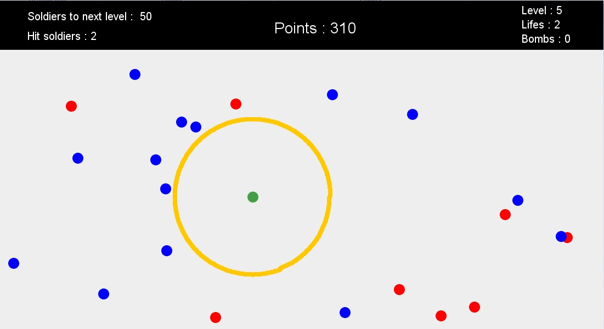
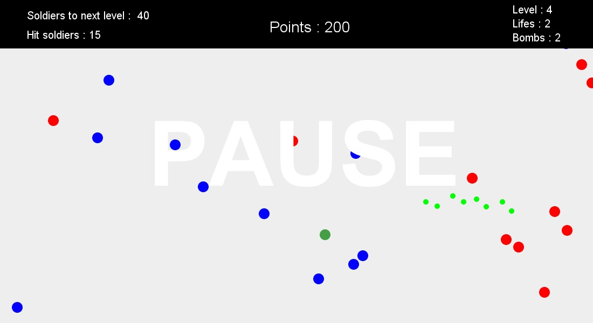
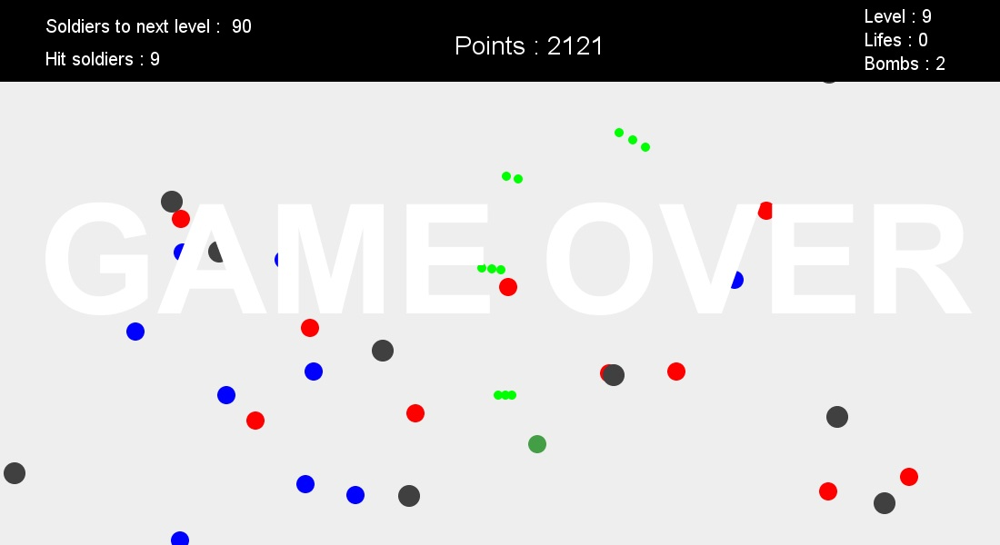

# Attack'N'Defend *(2D Java game)*

I had to develop some work for university so I made this game. I did it in 2013, when I started learning Java so it's not a big program, but can help starters. 

It is not finished, if I recall correclty it had 17 levels, it may not be well commented, and it lacks some features like a way to close the game (you will have to Alt + F4).

As a Defender, the goal is to scape from the Attackers, surviving as long as possible.

Controls are:

 * Q : Surrender
 * P : Pause & Resume
 * WASD : Move 
 * Mouse 
    * Left clic : Shoot
    * Right clic : Bomb

# Pictures

*Using a Bomb*

*Paused game*

*Game Over*

# Downloadable JAR
Wanna play ? Downloadable JAR [here](/releases/Game-AND.jar?raw=true)

